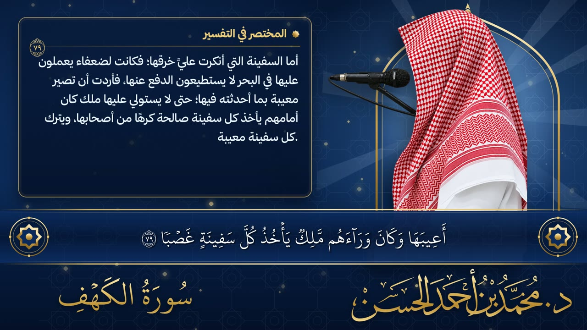
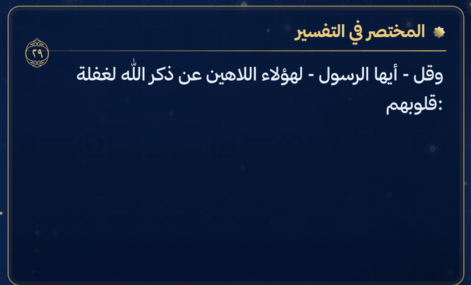
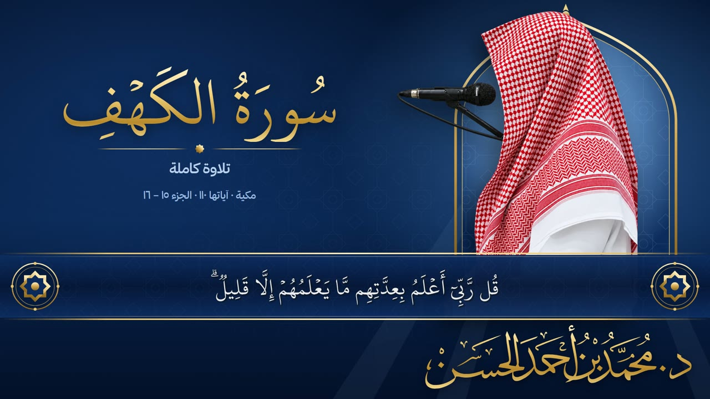
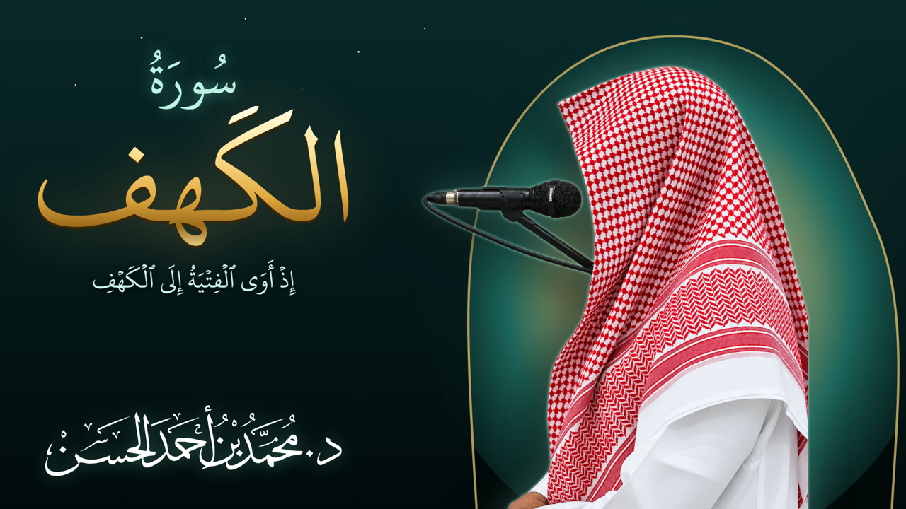
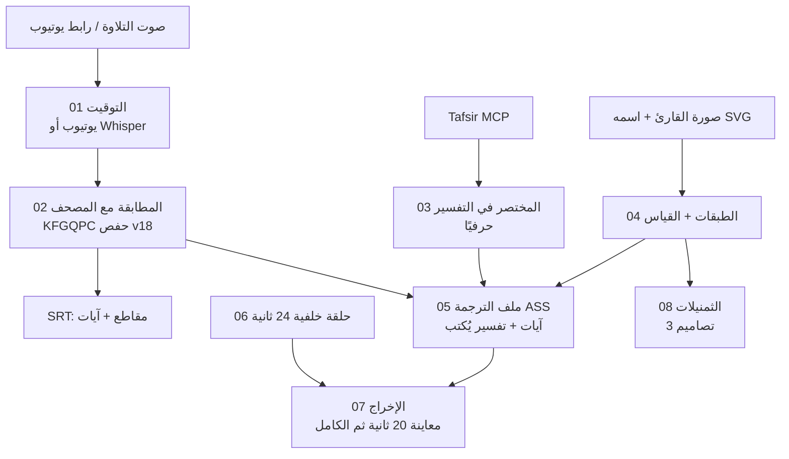

<p align="center">
  <picture>
    <source media="(prefers-color-scheme: dark)" srcset="assets/brand/logo-dark.svg">
    
  </picture>
</p>

<div dir="rtl">

# حزمة فيديو التلاوة — Quran Video Kit

حزمة جاهزة تصنع **فيديو تلاوة كامل** من ملف صوت (أو رابط يوتيوب) بدون برنامج مونتاج:

- آيات **مصحف حفص بالرسم العثماني** (مجمع الملك فهد، الإصدار 18) متزامنة مع صوت القارئ كلمةً بكلمة.
- **«المختصر في التفسير»** يُكتب حرفًا حرفًا في صندوق أنيق، حرفيًا من [Tafsir MCP](https://github.com/tafsircenter/tafsir-mcp).
- خلفية **متحركة** (نقش إسلامي ينساب، أشعة نور، ذرات ذهبية) وصورة القارئ داخل محراب، واسمه بالخط.
- ملفات **SRT** للآيات (مقاطع/آيات كاملة) لبرامج المونتاج.
- **3 ثمنيلات** معتمدة (أزرق · عاجي · أخضر الكهف) بمقاس يوتيوب.

> مثال حقيقي منفَّذ بالحزمة: سورة الكهف – د. محمد بن أحمد الحسن → `examples/kahf-alhassan/`

## عينات من المخرجات

<p align="center">
  
</p>

| التفسير يُكتب حرفًا حرفًا | التصميم الكلاسيكي (بدون تفسير) |
|---|---|
|  |  |

**الثمنيلات الثلاثة المعتمدة** (1280×720):

| أزرق | عاجي | أخضر الكهف |
|---|---|---|
|  |  |  |

**معاينة بالصوت (20 ثانية):** [`examples/kahf-alhassan/preview-20s.mp4`](examples/kahf-alhassan/preview-20s.mp4)

**للوكيل (Agent):** ابدأ بـ [`CLAUDE.md`](CLAUDE.md) ثم [`GUIDE.md`](GUIDE.md) — الدليل المفصّل خطوة بخطوة.

---

## الخريطة



| الخطوة | الملف | المُخرَج |
|---|---|---|
| 00 فحص البيئة | `pipeline/s00_check.py` | تقرير OK/FAIL مع طريقة الإصلاح |
| 01 التوقيت | `pipeline/s01_timing.py` | `work/words.json` |
| 02 المطابقة | `pipeline/s02_align.py` | `segments.srt` · `ayat.srt` · `ayah_times.json` |
| 03 التفسير | `pipeline/s03_tafsir.py` | `work/tafsir.json` |
| 04 الطبقات | `pipeline/s04_layers.py` | `L_bg/L_pat/L_rays/L_fg.png` · `layout.json` |
| 05 الترجمة | `pipeline/s05_subs.py` | `work/full.ass` |
| 06 الخلفية | `pipeline/s06_bgloop.py` | `work/bgloop.mp4` |
| 07 الإخراج | `pipeline/s07_render.py` | `output/*.mp4` |
| 08 الثمنيل | `pipeline/s08_thumbs.py` | `output/thumbnails/*.jpg` · `*.png` |
| الكل | `pipeline/run.py` | يشغّل الخطوات بالترتيب مع ذاكرة مؤقتة لكل خطوة |

## محتوى الحزمة

<div dir="ltr">

```
quran-video-kit/
├── README.md · GUIDE.md · CLAUDE.md
├── setup/            setup.ps1 (تثبيت كل شيء) · requirements.txt
├── pipeline/         الخطوات 00–08 + common.py + youtube_captions.py + particles.py
├── templates/
│   ├── video/        design.html (تصميم الفيديو) · measure.html (قياس النص)
│   └── thumbnails/   1-blue · 2-ivory · 3-green-cave  (+ extra/gold-friday-kahf)
├── assets/brand/     logo.svg · logo-dark.svg (شعار المستودع)
├── assets/fonts/     hafs (مصحف حفص v18) · thmanyah (يُنزَّل من مصدره الرسمي — لا يُعاد توزيعه)
├── vendor/           quran-data-kfgqpc · tafsir-mcp   (نسخ من المشاريع الأصلية)
├── skills/           quran-recitation-video · video-ad-editor (سكيل الإعلانات)
├── tools/            captions_proxy.py (بروكسي ترجمة يوتيوب التلقائية)
├── projects/         مشروع لكل فيديو: config.json + input/ + work/ + output/
└── examples/         مخرجات الكهف المرجعية (SRT · ثمنيل · معاينة · تفسير)
```

</div>

## البدء السريع (ويندوز)

<div dir="ltr">

```powershell
# 1) مرة واحدة على أي جهاز جديد
powershell -ExecutionPolicy Bypass -File setup\setup.ps1

# 2) مشروع جديد
mkdir projects\my-sura\input
#   ضع: input\audio.mp3 (أو youtube_url في الإعدادات) · input\reciter.png · input\reciter_name.svg (اختياري)
copy examples\kahf-alhassan\config.json projects\my-sura\config.json   # ثم عدّل sura/الاسم/المسارات

# 3) معاينة 20 ثانية + الثمنيلات
python -I pipeline\run.py projects\my-sura\config.json

# 4) بعد الموافقة: الإخراج الكامل (~13 دقيقة لكل 25 دقيقة تلاوة)
python -I pipeline\run.py projects\my-sura\config.json --from 7 --to 7 --full
```

</div>

## بروكسي ترجمة يوتيوب (توفير التوكن)

<div dir="ltr">

```powershell
python -I tools\captions_proxy.py --port 8765
# GET http://127.0.0.1:8765/captions?v=VIDEO_ID&lang=ar&save=<path\words.json>
```

</div>

يحفظ توقيتات الكلمات مباشرة في ملف ويُرجع سطرًا واحدًا `{"saved":…, "count":…}` — لا يمر النص على المحادثة. التفاصيل في `GUIDE.md §6`.

## المشاريع الأصلية والإسناد

| المشروع | الاستخدام هنا | الرابط |
|---|---|---|
| **Quran Data KFGQPC** — بيانات وخطوط مجمع الملك فهد لطباعة المصحف الشريف | نص الرسم العثماني (حفص v18) + خط `hafs.18.ttf` · نسخة في `vendor/quran-data-kfgqpc` | [github.com/thetruetruth/quran-data-kfgqpc](https://github.com/thetruetruth/quran-data-kfgqpc) · المصدر: [qurancomplex.gov.sa](https://qurancomplex.gov.sa/en/techquran/dev/) |
| **Tafsir MCP** — مركز تفسير للدراسات القرآنية | «المختصر في تفسير القرآن الكريم» عبر `fetch_tafsir` · نسخة في `vendor/tafsir-mcp` · كود MIT، بيانات CC BY 4.0 | [github.com/tafsircenter/tafsir-mcp](https://github.com/tafsircenter/tafsir-mcp) · [tafsir.net](https://tafsir.net) |
| **yt-dlp** | ترجمة يوتيوب التلقائية والصوت | [github.com/yt-dlp/yt-dlp](https://github.com/yt-dlp/yt-dlp) |
| **faster-whisper** | توقيت الكلمات عند غياب ترجمة يوتيوب | [github.com/SYSTRAN/faster-whisper](https://github.com/SYSTRAN/faster-whisper) |
| **FFmpeg + libass** | التركيب والإخراج والترجمة | [ffmpeg.org](https://ffmpeg.org) · [github.com/libass/libass](https://github.com/libass/libass) |
| **خط ثمانية** (Thmanyah Sans/Serif) | نص التفسير، الثمنيل، واسم القارئ عند غياب ملف الخط | مجاني للاستخدام، **لا يُعاد توزيعه** — نزّله من [الصفحة الرسمية](https://ask.thmanyah.com/hc/en-001/articles/45993930027281-Thmanyah-Font-for-Everyone) |

الالتزامات المثبّتة للنسخ في `vendor/PINNED_COMMITS.txt`.
**تنبيه الترخيص:** ملفات خط ثمانية غير موجودة في المستودع (ترخيصها يمنع إعادة التوزيع)؛ `setup.ps1` ينسخها من خطوط ويندوز المثبتة، أو نزّلها من الصفحة الرسمية وضعها في `assets/fonts/thmanyah/`. خط المجمع `hafs.18.ttf` منشور أصلًا في مستودع quran-data-kfgqpc ويخضع لاتفاقية الاستخدام داخل الملف.

</div>
